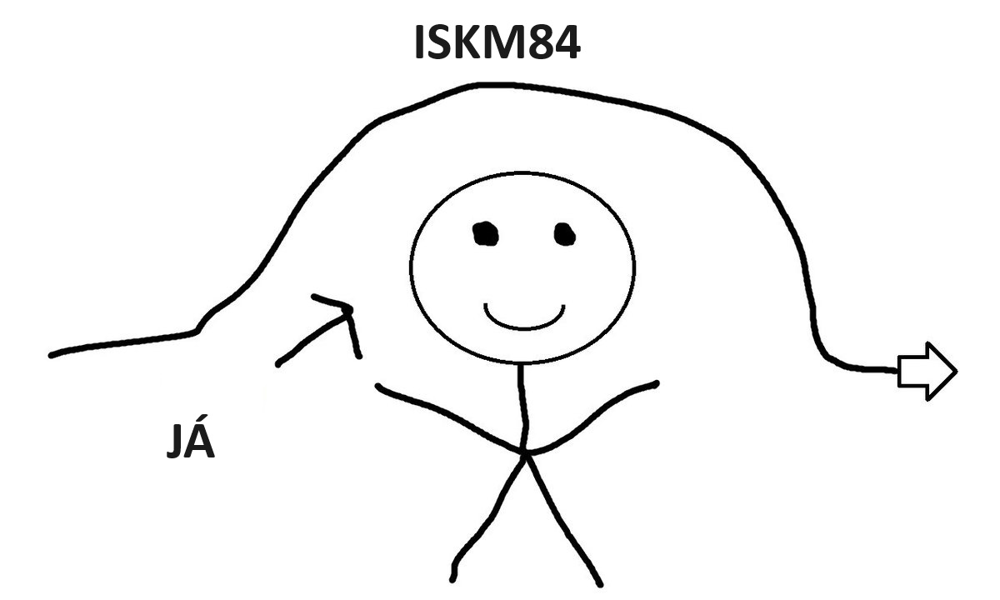

## ISKM84 - Reflexe
### 20.06.2023

Další předmět ze série, která se týká commons a řekněme moderního přístupu ke společnosti. Tentokrát se předmět zabýval zejména decentralizovanými autonomními organizacemi, neboli DAOs. Předmět se z velké části skládal z přednášek hostů, kteří jsou nějakým způsobem zainteresování v tomto tímatu. Přednášející tak byli například lidé ze studia Pábení, projektu Urbanika a nebo třeba nyní silně rezonující hnutí Nerůst. 

Popravdě asi nejsem schopen určit nějaký output, popravdě si ani pořádně nepamatuji náplň jednotlivých hodin a přednášek. Čím více nad tím přemýšlím, tím více mi tanou na mysli jen dvě věci z úvodní hodiny a to, jak jsme se úspěšně zasmáli tomu, jak to dopadlo s velkou nadějí v podobě NFT, kterým byla věnována podstatná část předcházejícího předmětu ISKM73 a dále pak informace od jednoho z kolegů, který na dotaz, proč si zapsal tento předmět odpověděl ***„lebo nenávidím kapitalizmus“***, což byla informace, o které jsem ani nevěděl, že po ní toužím, na tož abych věděl, jak s ní naložit. 

Já vlastně tento předmět nedokážu nijak vyhodnotit, protože jsem ho asi nepochopil. Veškeré mé pocity tak představuje následující variace na vele slavný mem:
