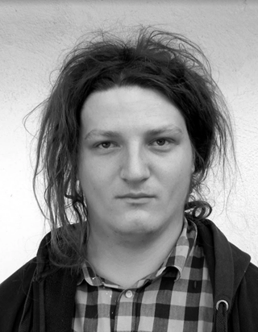

## Kontakt

Narodil a vychoval jsem se v Českých Budějovicích, ale  momentálně jsem zakotven v Brně.

Vystudoval jsem Aplikovanou informatiku na FSI VUT a Inteligentní budovy na FEL ČVUT. Pracuji jako fullstack developer. 

Mimo práci vcelku hodně cestuji, jezdím na kole a občas taky přiložím ruku k dílu na nějakém festivalu. V posledních letech je to zejména [Beseda u Bigbítu](https://www.besedaubigbitu.cz/), dříve třeba [Budějovický Majáles](https://budejovickymajales.cz/o-festivalu) nebo [Díky, že můžem - korzo národní](https://dikyzemuzem.cz/). 

Ještě na gymnáziu jsem míval kapelu, ale o tom se ve slušné společnosti [nemluví](https://www.youtube.com/watch?v=bnxkxeky7oQ). 

### Ozvěte se mi
 - E-mail: dytrych.pav@gmail.com
 - Sledujte mě: [instagram](https://www.instagram.com/bigvpicilajf/)/[linkedin](https://www.linkedin.com/in/pavel-dytrych-9070b7133/)